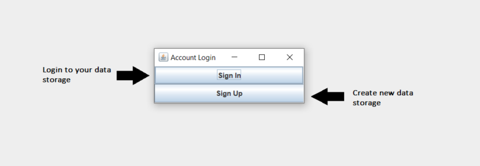
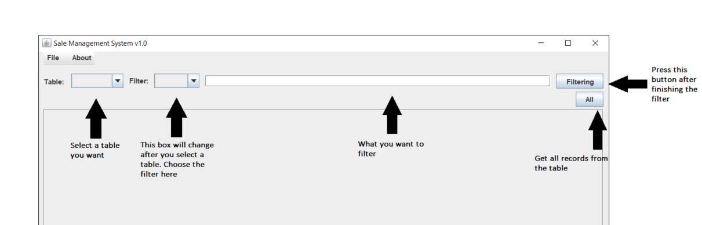
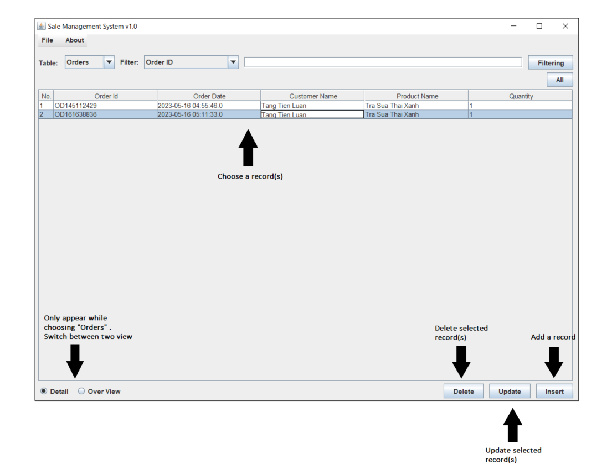
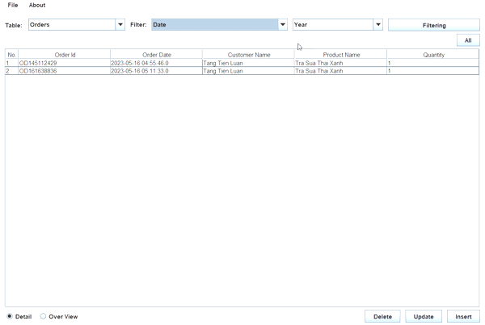

# **Sales-Management-System (v1.0)**

Our sales management program is a straightforward and effective tool for storing essential
information about customers (name and phone number) and products (name and price). 
It also allows you to manage purchase orders. You can easily record and update customer 
information, manage a list of available products, and track purchase orders.
The program provides a user-friendly interface, saving time and being easy to use.

## **Features**
- Login and registration functionality for user accounts, which store individual user data. The data is stored in an online database.
- Display of data in tables, including customer information, products, and purchase orders.
- Data filtering for each table based on the provided table information.
- Addition, deletion, and updating of records in each table.
- Switching between different view modes (including detailed and overview views) for the customer's purchase order table. The overview table can also be filtered by customer or product, by year, month, or day, and then display the total income for that specific time period.

## **Application guidelines**
- ### **Install the JDK 20.0.1**
    Window: <https://download.oracle.com/java/20/latest/jdk-20_windows-x64_bin.exe>  

- ### **Download SalesMSv1.0 .rar** 
  Link: https://github.com/luantang2102/Sales-Management-System/releases/download/v1.0/SalesMSv1.0.rar  

- ### **Using instructions**
  - After run .exe file:
  
  - After login: 
    
  - After choose a table: 
  
  - Date simple instruction:
  

## **Contact**
- **FB** :  [Luan Tang](https://www.facebook.com/luantang21/)
- **Email** : Luantang.work@gmail.com
